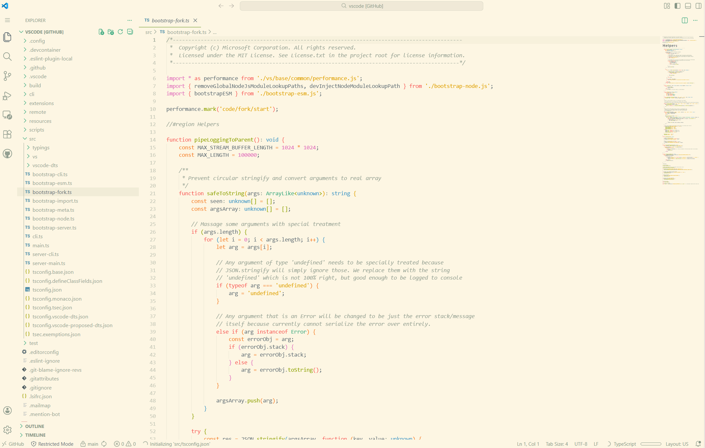
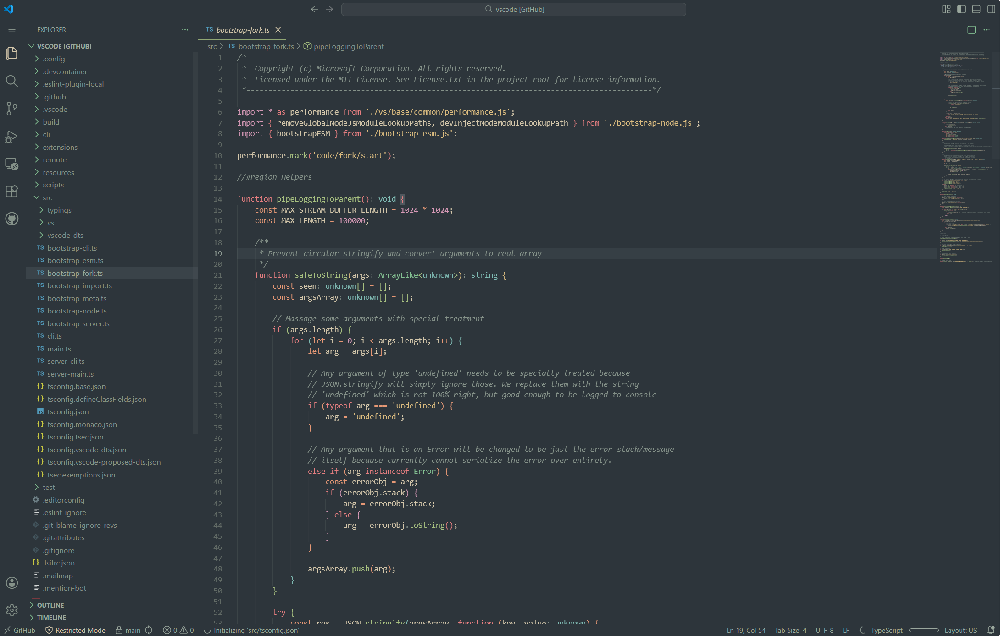

<div align="center">

# 🌲 Everforest Pro

### _A warm, eye-friendly color theme that brings the forest to your code_

### ☀️ Light Theme



### 🌙 Dark Theme



[](https://marketplace.visualstudio.com/items?itemName=AndreiLucaci.everforest-pro)
[](https://github.com/AndreiLucaci/everforest-vscode)
[](https://vscode.dev/theme/AndreiLucaci.everforest-pro/Everforest%20Pro%20Dark)
[](https://vscode.dev/theme/AndreiLucaci.everforest-pro/Everforest%20Pro%20Light)

</div>

---

## ✨ Why Everforest Pro?

**Your eyes deserve better.** If you're spending hours staring at code, you need a theme that doesn't just look good—it _protects_ your vision.

Everforest Pro is meticulously crafted with **warm, nature-inspired tones** and **carefully balanced contrast** to reduce eye strain during those marathon coding sessions. Whether you're reviewing PRs in the morning or deep in a debugging session late at night, this theme adapts to your needs with both light and dark variants.

### 🎯 Key Benefits

- **🛡️ Eye Protection First** - Soft, warm colors with optimized contrast reduce eye fatigue
- **🌿 Nature-Inspired Palette** - Green-based tones proven to be easier on the eyes
- **🌓 Light & Dark Modes** - Seamlessly switch based on time of day or preference
- **🎨 Highly Customizable** - Adjust contrast, background hardness, and workbench style
- **💡 Works All Day & Night** - Perfect harmony with blue light filters like f.lux and Redshift
- **🎯 Semantic Highlighting** - Intelligent syntax coloring that makes code easier to parse
- **📚 Rich Language Support** - Optimized for 40+ programming languages and frameworks
- **✍️ Optional Italic Support** - Elegant cursive keywords for supported fonts

---

## 🚀 Quick Start

### Installation

1. Open **Extensions** in VS Code (`Ctrl+Shift+X` or `Cmd+Shift+X`)
2. Search for `Everforest Pro`
3. Click **Install**
4. Click **Reload** to refresh your editor

### Activation

1. Open the **Command Palette** (`Ctrl+Shift+P` or `Cmd+Shift+P`)
2. Type `Color Theme`
3. Select **Everforest Pro Light** or **Everforest Pro Dark**

That's it! Your eyes will thank you. 🌟

---

## ⚙️ Customization

Everforest Pro offers extensive customization options to match your personal preferences:

### Available Settings

- **Background Contrast** - Choose from `hard`, `medium`, or `soft`
- **Workbench Style** - Select `flat`, `material`, or `high-contrast`
- **Italic Keywords** - Enable cursive italics for keywords
- **Italic Comments** - Toggle italic styling for comments
- **Custom Palette** - Fine-tune individual colors
- **🌅 Auto Theme Switching** - Automatically switch between light and dark themes

### 🌅 Auto Theme Switching (Pro Feature)

Let Everforest Pro automatically switch between light and dark themes based on your schedule!

**Time-Based Schedule:**

```json
"everforestPro.autoSwitch.enabled": true,
"everforestPro.autoSwitch.lightThemeTime": "07:00",
"everforestPro.autoSwitch.darkThemeTime": "19:00"
```

Perfect for protecting your eyes - light theme during the day, dark theme at night!

> **Note:** Settings are now organized into groups (`theme.*` and `autoSwitch.*`) for better organization. See the [migration guide](#-migration-from-v1x-to-v20) if upgrading from v1.x.

### How to Customize

1. Open **Settings** (`Ctrl+,` or `Cmd+,`)
2. Search for `Everforest Pro`
3. Adjust settings to your liking

---

## 💬 FAQ

**Q: How do I enable auto-switching themes?**

**A:** Enable scheduled theme switching in settings:

1. Search for `everforestPro.autoSwitch.enabled` and set it to `true`
2. Set your preferred times with `autoSwitch.lightThemeTime` and `autoSwitch.darkThemeTime` (24-hour format)

**Q: How do I enable italic keywords?**

**A:** To use cursive italic keywords:

1. Install a font with cursive italic support (e.g., [JetBrains Mono](https://www.jetbrains.com/lp/mono/), [Fira Code](https://github.com/tonsky/FiraCode))
2. Enable `everforestPro.italicKeywords` in settings
3. Optionally disable `everforestPro.italicComments` for better contrast

**Q: Can I use this theme at night?**

**A:** Absolutely! Switch to **Everforest Pro Dark** for nighttime coding, or enable auto-switching to do it automatically. Both variants are designed with the same eye-friendly principles.

**Q: Does this work with blue light filters?**

**A:** Yes! Everforest Pro is specifically designed to work harmoniously with tools like f.lux and Redshift.

---

## 🤝 Contributing

Found a bug or want to suggest an improvement? Contributions are welcome!

- **Report Issues:** [GitHub Issues](https://github.com/AndreiLucaci/everforest-vscode/issues)
- **Submit PRs:** [GitHub Repository](https://github.com/AndreiLucaci/everforest-vscode)

---

## 📄 License

[MIT License](./LICENSE)

---

## � Migration from v1.x to v2.0

Version 2.0 introduces a breaking change in settings structure for better organization.

### What Changed?

Settings are now grouped:

- **Theme settings:** `everforestPro.theme.*`
- **Auto-switch settings:** `everforestPro.autoSwitch.*`

### Quick Migration

Open your settings (JSON) and update:

```json
// OLD (v1.x)
"everforestPro.darkContrast": "medium",
"everforestPro.italicComments": true,
"everforestPro.autoSwitch": true,
"everforestPro.lightThemeTime": "07:00"

// NEW (v2.0)
"everforestPro.theme.darkContrast": "medium",
"everforestPro.theme.italicComments": true,
"everforestPro.autoSwitch.enabled": true,
"everforestPro.autoSwitch.lightThemeTime": "07:00"
```

### Complete Mapping

| Old Setting                       | New Setting                             |
| --------------------------------- | --------------------------------------- |
| `darkContrast`                    | `theme.darkContrast`                    |
| `lightContrast`                   | `theme.lightContrast`                   |
| `darkWorkbench`                   | `theme.darkWorkbench`                   |
| `lightWorkbench`                  | `theme.lightWorkbench`                  |
| `darkCursor`                      | `theme.darkCursor`                      |
| `lightCursor`                     | `theme.lightCursor`                     |
| `darkSelection`                   | `theme.darkSelection`                   |
| `lightSelection`                  | `theme.lightSelection`                  |
| `italicKeywords`                  | `theme.italicKeywords`                  |
| `italicComments`                  | `theme.italicComments`                  |
| `diagnosticTextBackgroundOpacity` | `theme.diagnosticTextBackgroundOpacity` |
| `highContrast`                    | `theme.highContrast`                    |
| `autoSwitch`                      | `autoSwitch.enabled`                    |
| `lightThemeTime`                  | `autoSwitch.lightThemeTime`             |
| `darkThemeTime`                   | `autoSwitch.darkThemeTime`              |
| ~~`autoSwitchMode`~~              | _(removed)_                             |

---

## �🙏 Credits

This theme is based on the excellent [Everforest](https://github.com/sainnhe/everforest-vscode) color scheme by [sainnhe](https://github.com/sainnhe) (which is sadly archived now).
